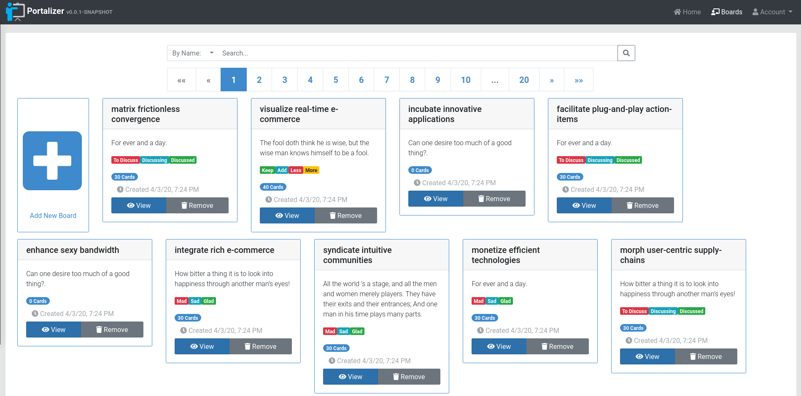
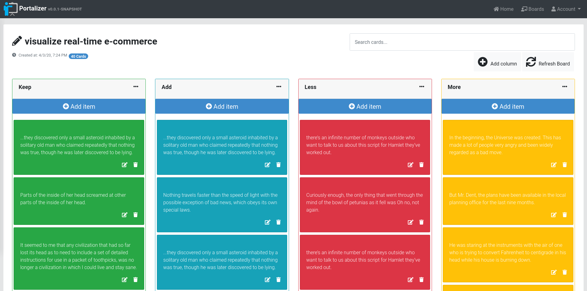
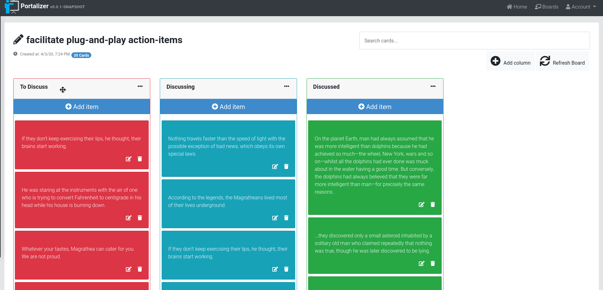
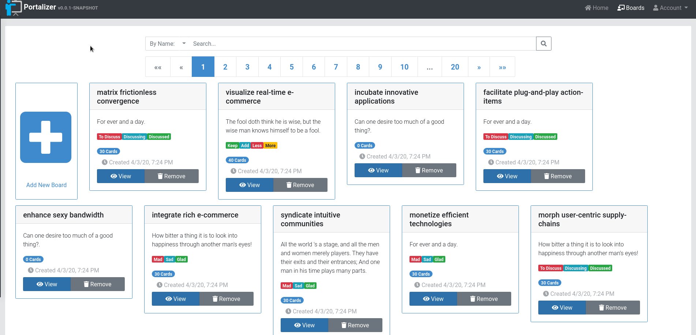

#  Portalizer

### The project is an open-source Kanban-style list application and aims to be used for sprint retrospective, activity planning and task tracking.

## You can check out a live demo here: https://portalizer.org/


## Portalizer Screenshots


<table>
  <tr>
     <td>Boards Page</td>
     <td>Board Details</td>
  </tr>
  <tr>
    <td></td>
    <td></td>
  </tr>
 </table>


 <table>
  <tr>
     <td>Drag and drop</td>
     <td>Search</td>
  </tr>
  <tr>
    <td></td>
    <td></td>
  </tr>
 </table>

  <table>
  <tr>
     <td>Custom Board</td>
  </tr>
  <tr>
    <td></td>
  </tr>
 </table>


## Tech Stack
* [JHipster](https://www.jhipster.tech/)

* [Spring Boot](https://spring.io/projects/spring-boot) 

* [Angular 8](https://angular.io/)

* [Bootstrap 4](https://getbootstrap.com/) 

## Local Installation: 

### Docker Hub

`docker pull andreisasu/portalizer:latest`

`docker run -e ADMIN_PASS=<admin_password> -e USER_PASS=<user_password> <container_id>`

#### Databases
By default, the application will use an embedded H2 in memory database.

MySQL is also available with the `mysql` spring profile.

_You might need a mysql container up and running_:
https://github.com/AndreiSasu/portalizer.org/tree/master/monolithic#using-docker-to-simplify-development-optional

`docker run -e _JAVA_OPTIONS="-Dspring.profiles.active=prod,mysql" -e ADMIN_PASS=<admin_password> -e USER_PASS=<user_password> <container_id>`

You can override the mysql user / password by specifying: `-Dspring.datasource.user=<username> -Dspring.datasource.password=<password>` and the url by specifying `-Dspring.datasource.url=jdbc:mysql://<hostname>:<port>/<schema>?option1=value1&option2=value2` if you need to.

#### Sample Data
If you want to have some sample data populated (boards, cards), use the `testdata` spring profile

Ex: 

`docker run -e _JAVA_OPTIONS="-Dspring.profiles.active=prod,h2,testdata" -e ADMIN_PASS=<admin_password> -e USER_PASS=<user_password> <container_id>`


The sample data has been generated using [**Java Faker**](https://github.com/DiUS/java-faker)

#### API Docs
API documentation is available via Swagger, enable it via the `swagger` spring profile.

#### Authentication
By default, all boards are publicly accessible. 
You can require authentication via the `enable-auth` spring profile. 


## Changelog
**1.0.1-RELEASE** 
This is a maintenance version, upgrading to Angular 9. 

**1.0.0-RELEASE** Initial version 

   - Support for creating sprint retrospective boards from predefined templates: 
   
      * Mad, Sad, Glad

        ```Mad, Sad, Glad is a popular retrospective technique that encourages team members to think about their emotions. How does the team feel after the last sprint? Mad, Sad, Glad is simple to learn while being easy to explain and run.```

      * What Went Well, What To Improve, Action Items

        ```Focuses on the strengths and weaknesses of the team based on the previous sprint.```

      * KALM: Keep, Add, Less, More

        ```KALM (Keep, Add, More, less) is a retrospective activity that fosters the conversation to the current activities and the perceived value. It helps team members to understand each other perceived value on such practices.```

      * Start, Stop, Continue

        ```Start, Stop, Continue is an action-oriented retrospective technique that encourages participants to come up with practical ideas for team-based improvement.```

      * 4Ls: Liked, Learned, Lacked, Longed For

        ```4Ls stands for Liked Learned Lacked Longed For. The 4Ls technique is a brainstorming technique for collecting feedback on a recently completed project or piece of work. This retrospective highlight the positive (liked & learned) as well as the negative (lacked & longed for). The team have to think mostly from a factual (what happened) perspective, rather than an emotional perspective.```


      * Lean Coffee: To Discuss, Discussing, Discussed

        ```From the Lean Coffee website, we have that “Lean Coffee is a structured, but agenda-less meeting. Participants gather, build an agenda, and begin talking. Conversations are directed and productive because the agenda for the meeting was democratically generated.”```


      * DAKI: Drop, Add, Keep, Improve

        ```The DAKI (or Drop Add Keep Improve) retrospective activity is suitable to use after several sprints working with the same team. As your team members are experimenting with different processes, it helps cull out non-value things, keep what is working, and improve by brainstorming on new ways to work.```

      * Starfish: Keep Doing - Less Of - More Of - Stop Doing - Start Doing
      
        ```Starfish is a great data gathering activity to foster the thinking around practices and the value the team get from it. It helps team members to understand each other perceived value on such practices.```

   - Support for creating empty boards
   - Support for adding / removing board columns
   - Drag and drop support for cards and board columns
   - Search boards by Name and Description.

## TODO:
 - WebSocket support to broadcast all board/card events to connected users.
 - Add voting and comment system support for cards.
 - Add image preview and file attachment support for cards.
 - Add private boards and invitation system.
 - Enable user defined board templates to be saved and reused.
 - Social Login and LDAP / AD integration.

## License and Copyright

Copyright (c) 2020 Andrei Sasu

[GNU General Public License V3](LICENSE)
