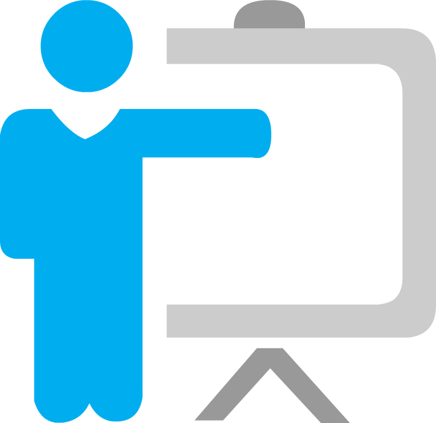
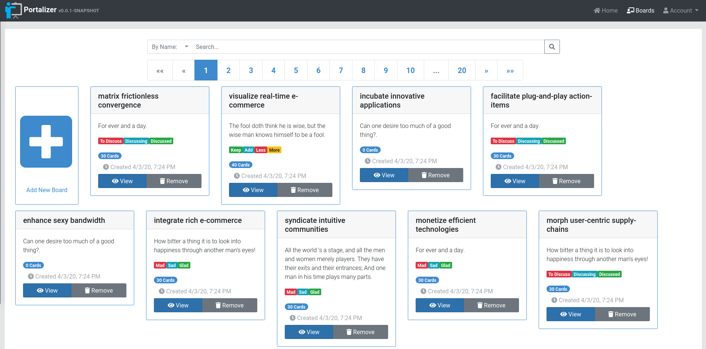
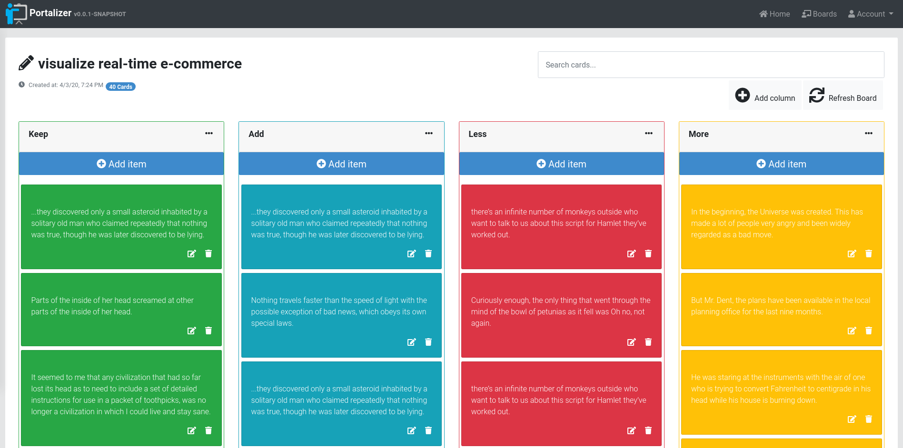

#  Portalizer 

### The project is an open-source Kanban-style list application and aims to be used for sprint retrospective, activity planning and task tracking.

#### You can check out a live demo here: https://portalizer.org/

## Portalizer Screenshots

<table>
  <tr>
     <td>Boards Page</td>
     <td>Board Details</td>
  </tr>
  <tr>
    <td></td>
    <td></td>
  </tr>
 </table>

## Tech Stack
* [JHipster](https://www.jhipster.tech/)

* [Spring Boot](https://spring.io/projects/spring-boot)

* [Angular 8](https://angular.io/)

## Installation: 

### Docker Hub

`docker pull andreisasu/portalizer:latest`

By default, the application will use an embedded H2 in memory database.

MySQL is also available with the `mysql` spring profile.

`docker run -e _JAVA_OPTIONS="-Dspring.profiles.active=prod,mysql" -e ADMIN_PASS=<admin_password> -e USER_PASS=<user_password> <container_id>`

If you want to have some sample data populated (boards, cards), use the `testdata` spring profile

Ex: 

`docker run -e _JAVA_OPTIONS="-Dspring.profiles.active=prod,h2,testdata" -e ADMIN_PASS=<admin_password> -e USER_PASS=<user_password> <container_id>`

## Changelog
Initial version **1.0.0-RELEASE**

   - Support for creating sprint retrospective boards from predefined templates: 
      * Mad, Sad, Glad
      * What Went Well, What To Improve, Action Items
      * KALM: Keep, Add, Less, More
      * Start, Stop, Continue
      * 4Ls: Liked, Learned, Lacked, Longed For
      * Lean Coffee: To Discuss, Discussing, Discussed
      * DAKI: Drop, Add, Keep, Improve

   - Support for creating empty boards
   - Support for adding / removing board columns
   - Drag and drop support for cards and board columns
   - Search boards by Name and Description.

## TODO:
 - WebSocket support to broadcast all board/card events to connected users.
 - Add voting and comment system support for cards.
 - Add image preview and file attachment support for cards.
 - Add private boards and invitation system.
 - Enable user defined board templates to be saved and reused.
 - Social Login and LDAP / AD integration.
